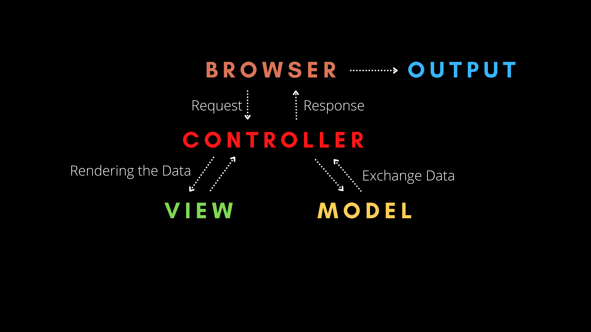
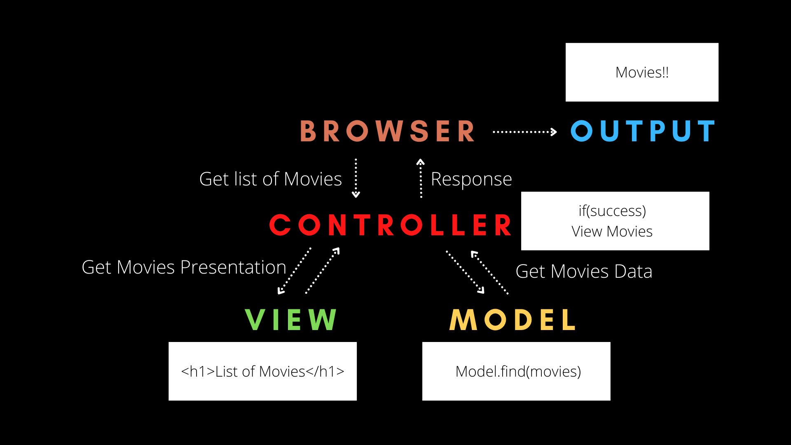

# MVC

## **MVC - Model View Controller**
***

- Over last 2 decades, Websites have changed from simple pages to little CSS to JavaScript to become much more complex & powerful application day by day

- To develop these websites & application programmers use different pattern & Software Architecture to make things simple

### **Software Architecture**
***
- A Software Architecture is a systematic way in which software is describe

- It also maintains the relationship with other software & How they inrteract with each other

- It includes factors like **Business Strategy, Quality, Design, Human Dynamics & IT environment**

- **Architecture == Blue Print for a System**

### **MVC - Model View Controller**
- Most Popular Software Architecture
- It is divided into 3 parts:-
  - **1. Model**
  - **2. View**
  - **3. Controller**
  
### **Model**
***
- Model contains all the data related logic that user works with like **Schema & interface of the project, Database and Fields**
- Example:
    - A Customer Instance will retrieve the Cus_Info from database, Manipulate & Update thier Records or Use it to render Data.

### **View**
***
- View contains the **UI** and **Presentation of an application**
- Example: 
    - Customer View include all the **UI Components** such as TextBoxes, Buttons, DropDowns and other things to interact with Users
    
### **Controller**
***
- Controller contains all the **Business Related Logic and handled incoming requests**

> **Controller is interface between Model and View**

- Example: 
    - Customer Controller will handle all the **interactions and inputs from the Customer view** and **update the database using Customer Model**
    - The same controller will be used to View the Customer Data
    
 
 

## **Working of MVC**
***
- **First, the Browser sends a Request to the Controller**
  - Then Controller intercats with Model to send & receieve data
 
- **The Controller then Interact with Biew to render data**
  - The view is only concern about how to present information
  - It will be a dynamic HTML file that renders data based on what the Controller sends to it
  
- **Finally, View will send its final presentation to Controller and Controller will send it to as User Output**

> ***Note : "View and Model never interact with each other" Only interaction takes place between them through Controller***
> This means the logic of application and the Interface of the application never interact with each other, which makes writting complex application easier!

- Example:
  - A user input they want to search a list of movie through a Web brower or Mobile Application
  - The Browser will then send the Request to the Controller to get the list of movies
  - Next, The Controller will ask the Model to find the list of movies from the database
  - Then, The Model searches the database and return the list of movies to the Controller
  - If Controller gets the list of movies from the Model, the Controller ask the View for Render or present the list of movies
  - Then The View will receive the request and return the rendered list of movies to the Controller in HTML
  - Lastly, The Controller will take that HTML and return it back to the User, Thus The list of movies as Output as of screen
  
  
### Summary
***
- **There are a lot of software architecture, MVC is one of the most popular and widely used**
- **It reduce the code complexity and makes software easily understandable**

